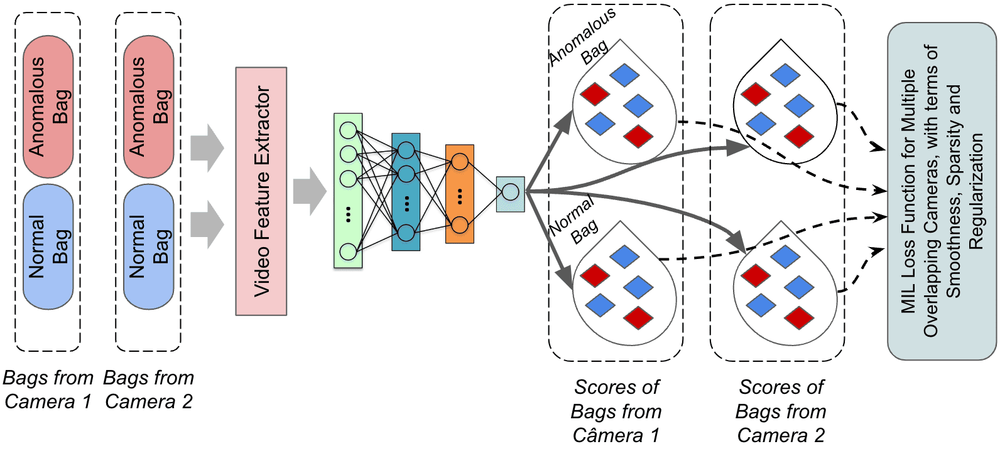
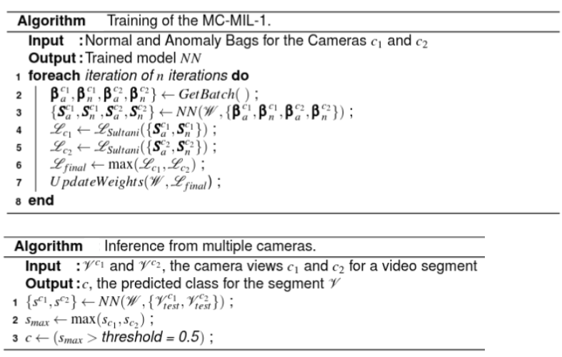
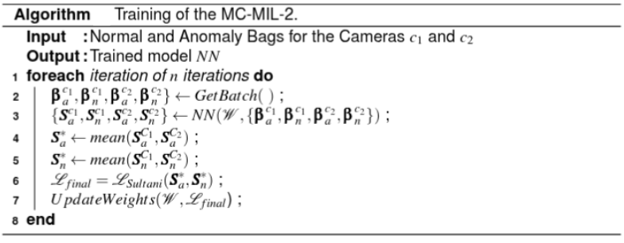

# MC-VAD-MIL
Research on Video Anomaly Detection with Multiple Overlapping Cameras

## Video Surveillance  Anomaly  Detection  with  Multiple  Overlapped  Cameras  based  on  Multi-Instance  Learning

We propose the conceptual framework MC-MIL (Video Anomaly Detection with Multiple overlapping Cameras and Multiple Instance Learning), which allows the conception of loss functions that simultaneously consider information from multiple cameras. Within this framework, we propose two multi-camera algorithms for VAD. The first algorithm, MC-MIL-1, trains an anomaly regression network for multiple cameras, so there is no growth in the number of parameters. The second method, MC-MIL-2, employs a multiview neural network to learn the specificities of each camera view and a strategy for bag summarization to improve the network's performance.



The MC-MIL-1 and MC-MIL-2 algorithms are described as following:





We use three different VAD-MIL algorithms as "backbones" to prototype our proposed MC-MIL framework.  We use the MIL backbones of Sultani et al. (2018), Wan et al. (2020) to implement the conceptual framework and evaluate the proposed multi-camera algorithms. The following open-source repositories were used to implement our conceptual multi-camera framework:

* [Anomaly_AR_Net_ICME_2020](https://github.com/wanboyang/Anomaly_AR_Net_ICME_2020) by wanboyang.
* [AnomalyDetectionCVPR2018-Pytorch](https://github.com/ekosman/AnomalyDetectionCVPR2018-Pytorch/tree/main) by ekosman.

The code in this repository builds upon the aforementioned frameworks and modifies them to suit the specific needs of this project. 
Please refer to the respective repositories for more details on the original frameworks and feature extraction library.

### Feature Extraction

This framework utilizes I3D video features extrated with the feature extraction library from [video_features](https://github.com/v-iashin/video_features).


## Datasets Used

The original datasets used in this research are publicly available from the following sources:

- **PETS-2009**  
  https://cs.binghamton.edu/~mrldata/pets2009

- **HQFS (High Quality Fall Simulation Data)**  
  https://iiw.kuleuven.be/onderzoek/advise/datasets#High%20Quality%20Fall%20Simulation%20Data

- **UP-FALL**  
  https://sites.google.com/up.edu.mx/har-up/

### Preprocessed datasets

**Download the extracted I3d features for Pets-2009, HQFS and UP-FALL datasets from the link below:**

> [**https://zenodo.org/records/14655606**](https://zenodo.org/records/14655606)

Each preprocessed video in these datasets has the following structure:
```
{
    "name": "Name of the scene"
    "X_i": Matrix of video clips versus deep features,
    "y_i": MIL label,
    "y_fi": frame labels,
}
```

### Organization

- mil_bkbn_sult: The implementation of MC-MIL framework and its algorithms using the method of Sultani et al as MIL backbone;
- mil_bkbn_wan: The implementation of MC-MIL framework and its algorithms using the method of Wan et al as MIL backbone;
- data_preparation: scripts for data preparation;
- baselines: scripts for ML baselines;
- video_feature_extraction: script for video feature extraction;
- analysis: scripts and jupyter notebooks for analysis of results;

### Setup of your environment

Create a conda environment in your linux distribution:

```
$ conda env create -f environment.yml
```

To activate this environment:

```
$ conda activate mc-vad-mil
```

### Data Preparation

According to the MIL backbone used for our MC-MIL algorithms, you need to prepare the *.npy files for the correct input.
Scripts to prepare the data are available at *data_preparation* folder.

### Training and Evaluation of MC-VAD-MIL algorithms

Train the MC-MIL-1-MC-MIL-2 multicamera algorithms with the MIL backbone of Sultani et al using the following commands:

```
$ cd mil_bkbn_sult
$ python mcmil1_n_cams_training_and_eval.py
$ python mcmil2_n_cams_training_and_eval.py
```

Train the MC-MIL-1-MC-MIL-2 multicamera algorithms with the MIL backbone of Wan et al using the following commands, according to the number of overlapping cameras and dataset:

```
$ cd mil_bkbn_wan/ArNetMcMiVad-NCams
$ python yeld_run_mcmil1_pets.py
$ python yeld_run_mcmil2_pets.py
```


### Baselines for performance comparison

To evaluate our proposed approach, different baselines can be considered:

- SC-SUP: Single-camera supervised baseline with LGBM classifier;
- SC-OCC: Sigle-camera OCC baseline with Deep SVDD (DSVDD)
- SC-MIL: Single-camera MIL model with a specific MIL backbone
- MC-SUP-FC: multi-camera supervised baseline by linear concatenation of video clip features;
- MC-OCC-FC: Multi-camera OCC baseline by linear concatenation of video clip features;
- MC-MIL-SLF: Multi-camera MIL baseline by simple late score fusion of camera-specific SC-MIL models;
- MC-MIL-FC: Multi-camera MIL baseline by linear concatenation of video clip features

### PhD Thesis

The PhD thesis associated with this project is available at this [link](https://siduece.uece.br/siduece/trabalhoAcademicoPublico.jsf?id=117452).

### Citation

If you find this repo useful for your research, please consider citing our [paper]([https://github.com/wanboyang/Anomaly_AR_Net_ICME_2020](https://link.springer.com/article/10.1007/s00521-024-09611-3)):

```bibtex
@article{pereira2024mc,
  title={MC-MIL: video surveillance anomaly detection with multi-instance learning and multiple overlapped cameras},
  author={Pereira, Silas SL and Maia, Jos{\'e} Everardo Bessa},
  journal={Neural Computing and Applications},
  volume={36},
  number={18},
  pages={10527--10543},
  year={2024},
  publisher={Springer}
}
```
---

